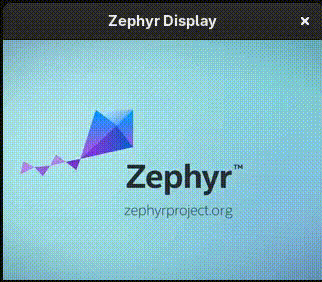

# LVGL Animation

[](https://www.apache.org/licenses/LICENSE-2.0)
[](https://zephyrproject.org/)

## Overview

Plays a frame-by-frame animation extracted from a video file using the LVGL
animation API. Frames are generated at build time by `video_to_lvgl_frames.py`
and stored as C arrays. Display width, height, and pixel format are extracted from
the `zephyr,display` chosen node in device tree source.



## Requirements

- `ffmpeg` / `ffprobe` in `PATH`
- Python 3 + Pillow: `pip install Pillow`
- A board with a display

### Initialization

The first step is to initialize the workspace folder (``workspace``) where
the ``lvgl-animation`` and all Zephyr modules will be cloned. Run the following
command:

```shell
# initialize workspace for the lvgl-animation (main branch)
west init -m https://github.com/walidbadar/lvgl-animation --mr main workspace
# update Zephyr modules
cd workspace
west update
```

## Building and Running

Set the video path in `prj.conf`:

```kconfig
CONFIG_LVGL_ANIMATION_VIDEO_PATH="/path/to/video.mp4"
```

Example building for `native_sim`:

```shell
west build -b native_sim app
west build -t run
```

Example building for `uedx24240013_md50e`:

```shell
west build -b uedx24240013_md50e app
west flash
```
